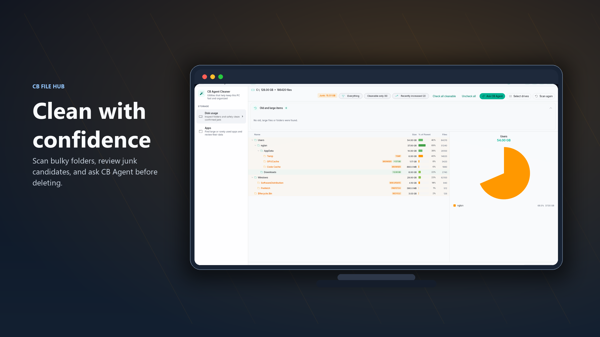

# CB File Hub

[](https://github.com/coolbirdzik/cb-file-hub/actions/workflows/build-test.yml)
[](https://github.com/coolbirdzik/CB-File-Hub/actions/workflows/release.yml)

<p align="center">
  
</p>

<table align="center">
  <tr>
    <td align="center" valign="middle">
      <a href="https://apps.microsoft.com/detail/9nchpzkc4m5c?referrer=appbadge&mode=full" target="_blank" rel="noopener noreferrer">
        
      </a>
    </td>
    <td align="center" valign="middle">
      <a href="https://play.google.com/store/apps/details?id=com.cbv.filehub" target="_blank" rel="noopener noreferrer">
        
      </a>
    </td>
  </tr>
</table>

CB File Hub is a cross-platform file manager for large media libraries. It combines fast visual browsing, tabs, tags, network access, disk cleanup, and an AI assistant so photos, videos, downloads, and messy folders are easier to search, review, and maintain.

## Key Highlights

- **AI-assisted file management**: Search, organize, review suspicious files, and guide cleanup workflows with CB Agent.
- **Disk cleaner with AI review**: Scan large drives, inspect junk candidates, and ask CB Agent before deleting uncertain files or folders.
- **Media-first browsing**: Use thumbnails, gallery views, and video previews designed for photo and video heavy folders.
- **Tabbed workflow on desktop and mobile**: Keep multiple locations open and switch contexts quickly.
- **Tags, smart albums, and discovery tools**: Organize large libraries beyond folder names.
- **Local and network access**: Browse local storage, SMB shares, and FTP in one workflow.

## Preview

<table>
  <tr>
    <td colspan="4">
      
      <p align="center"><sub>Desktop file browsing with tabs, tags, and rich previews</sub></p>
    </td>
  </tr>
  <tr>
    <td colspan="4">
      
      <p align="center"><sub>AI-assisted search beside the file browser</sub></p>
    </td>
  </tr>
  <tr>
    <td colspan="4">
      
      <p align="center"><sub>Disk cleanup with scan results, category review, and CB Agent guidance</sub></p>
    </td>
  </tr>
  <tr>
    <td align="center">
      
      <p align="center"><sub>Mobile home</sub></p>
    </td>
    <td align="center">
      
      <p align="center"><sub>File grid</sub></p>
    </td>
    <td align="center">
      
      <p align="center"><sub>Tabs</sub></p>
    </td>
    <td align="center">
      
      <p align="center"><sub>Tags</sub></p>
    </td>
  </tr>
</table>

### AI Agent

The AI side panel sits beside the file browser. Ask it to find files, clean up duplicates, or organize folders — it shows results inline and asks for approval before making any changes.

### Disk Cleaner

Scan a drive, inspect bulky folders and junk candidates, then ask CB Agent for a risk-aware review before cleaning anything uncertain.

### AI-guided cleanup review

In the disk cleaner, you can right-click any file or folder and ask CB Agent whether it should be deleted. The agent receives the current path, type, size, file count, and junk classification, then explains what the item is likely used for, the risks of deleting it, and gives a clear recommendation to delete, keep, or review it manually.

## Main Features

### File management and browsing

- Browse local storage and network locations in a unified interface.
- Open directories in multiple tabs.
- Use the same tab-oriented workflow across desktop and mobile.
- Pin folders, drives, or favorite locations to the sidebar.
- Restore the last opened tab workspace when returning to the app.

### AI file agent

- Search across folders with natural-language requests instead of exact file names.
- Create files and folders from user intent when routine setup work gets repetitive.
- Manage files with guided actions such as rename, move, copy, delete, and batch organization.
- Find files that may need attention, including broken media, missing thumbnails, duplicates, odd names, or misplaced items.
- Sort messy downloads, recordings, photos, and videos into clearer folder structures.
- Assist with larger cleanup workflows while keeping file operations visible and controllable.

### Disk cleaner

- Scan Windows drives for large folders, temporary files, browser caches, recycle-bin content, and other cleanup candidates.
- Browse scan results in a virtualised tree that remains responsive with large directory counts.
- Select cleanup candidates manually or by category.
- Review selected files and folders with CB Agent before deleting.
- Move supported cleanup targets to the Recycle Bin instead of deleting blindly.

### Tagging and discovery

- Add tags to files to create your own organization layer beyond folder names.
- Search by tag using direct tag paths and multi-tag filtering.
- Reuse recent and popular tags for faster tagging.
- Display tags directly in file and gallery views for quick visual context.
- Build a parent/child tag hierarchy and browse it as an expandable tree.
- Filter and sort tags in the tag manager, and switch between list, grid, and tree layouts.

### Tree view

- Browse hierarchical data as a virtualised, expandable tree that stays smooth even with very large folders.
- Available in the tag manager (parent/child tags), the local file browser, and network browsers (SMB/FTP).
- Folders load their children on demand the first time they are expanded, then cache the result.

### Media workflow

- Generate image, video, and folder thumbnails.
- Tune video thumbnail extraction position from settings.
- Browse dedicated image and video gallery views.
- Use the built-in video player for local and supported network files.
- Support desktop-oriented media workflows such as external opening and focused playback.

### Network access

- Browse SMB shares.
- Connect to FTP servers.
- Generate thumbnails for supported network files.
- Stream supported media directly from network locations.
- Store network credentials locally for faster reconnects.

### Album automation

- Create albums for curated collections.
- Create smart albums driven by dynamic rules.
- Match files into albums automatically based on filename patterns.
- Scope rules to selected source folders so albums stay relevant instead of noisy.

## Platforms

- Windows
- Android
- Linux
- macOS

## Downloads

Latest packaged builds are published here:

[Download Latest Release](https://github.com/coolbirdzik/cb-file-hub/releases/latest)

Available package types include:

- Windows: portable ZIP, EXE installer, MSI installer
- Android: APK and AAB
- Linux: `tar.gz`
- macOS: ZIP

## Quick Start

### Windows

1. Download the latest Windows package from the releases page.
2. Install with the EXE or MSI package, or extract the portable ZIP.
3. Run `cb_file_manager.exe`.

### Android

1. Download the latest APK.
2. Allow installation from unknown sources if needed.
3. Install and launch the app.

### Linux

```bash
tar -xzf CBFileManager-<version>-linux.tar.gz
cd bundle
./cb_file_manager
```

### macOS

1. Download the macOS ZIP package.
2. Extract it and move the app into `Applications`.
3. Open it from Finder.

## Development

This repository is a workspace, not a single Flutter package:

```text
cb_file_manager/   main Flutter app
mobile_smb_native/ local SMB/CIFS FFI plugin
scripts/           build, screenshot, version, and CI helpers
installer/         Windows installer configuration
justfile           primary developer command runner
```

Run `just` recipes from the repository root. Run direct `flutter` and `dart` commands from `cb_file_manager/`.

### Prerequisites

- Flutter SDK 3.41.5 stable
- Dart SDK bundled with that Flutter SDK
- `just`
- Git Bash on Windows, used by the repository `justfile`
- Visual Studio 2022 with C++ tools for Windows builds
- Android SDK and JDK 17+ for Android builds
- GTK3 development libraries for Linux builds
- Xcode and CocoaPods for macOS builds

### Local setup

```bash
git clone https://github.com/coolbirdzik/cb-file-hub.git
cd cb-file-hub
just deps
cd cb_file_manager
flutter run
```

Enable the developer overlay only for local development:

```bash
flutter run --dart-define=CB_SHOW_DEV_OVERLAY=true
```

### Common commands

```bash
# From the repository root
just              # list recipes
just deps         # install dependencies
just verify       # format check + analyze
just test         # unit and widget tests
just e2e-parallel # Windows E2E tests
just clean
```

### Build commands

```bash
just windows
just windows-msi
just android
just android-aab
just linux
just macos
```

Direct Flutter commands are also valid when run inside `cb_file_manager/`:

```bash
flutter pub get
flutter test
flutter analyze
dart format --output=none --set-exit-if-changed .
flutter test integration_test -d windows --dart-define=CB_E2E=true
```

### Screenshot automation

Generate lightweight showcase screenshots for the main app features on desktop and Android:

```bash
# Windows desktop screenshots
./scripts/capture_screenshots.sh desktop

# Android screenshots, using first connected Android device or emulator
./scripts/capture_screenshots.sh android

# Both targets
./scripts/capture_screenshots.sh all
```

On Windows PowerShell, use the native script instead of the Bash wrapper:

```powershell
# Windows desktop screenshots
./scripts/capture_screenshots.ps1 desktop

# Android screenshots, using the first connected Android device or emulator
./scripts/capture_screenshots.ps1 android

# Both targets
./scripts/capture_screenshots.ps1 all
```

Output files are copied to:

```text
screenshots/auto/desktop/
screenshots/auto/android/
```

The screenshot scripts use a dedicated showcase E2E flow and export only the final hero frames for each featured scenario, not every intermediate test step.

Android requires a connected device or running emulator visible in `flutter devices`.

Generate promotional artwork from the captured screenshots:

```powershell
python scripts\make_promo_images.py
```

The generated artwork is written to `screenshots/promo/desktop/`, `screenshots/promo/mobile/`, `screenshots/promo/tablet7/`, and the matching Vietnamese folders under `screenshots/promo/vi/`.

## Testing

```bash
just verify
just test
just e2e-parallel
```

## Project Structure

```text
cb_file_manager/
├── lib/                Flutter application source
├── test/               Unit and widget tests
├── integration_test/   E2E and showcase screenshot tests
├── tool/               E2E runner, dashboard, and reporting tools
└── pubspec.yaml

mobile_smb_native/      Local SMB/CIFS FFI plugin
scripts/                Build, screenshot, release, and CI scripts
installer/              Windows installer definitions
docs/                   Feature and UI implementation notes
```

## Documentation

- [Project agent instructions](AGENTS.md)
- [Agent architecture graph](docs/agent/index.md)
- [Technical documentation](docs/technical/index.md)
- [Feature notes](docs/features/)
- [UI pattern notes](docs/ui-patterns/)
- [Build script](scripts/build.sh)
- [Version helper](scripts/version.sh)

## Contributing

Contributions are welcome. Open an issue for bugs or feature requests, or submit a pull request if you want to improve the app.
