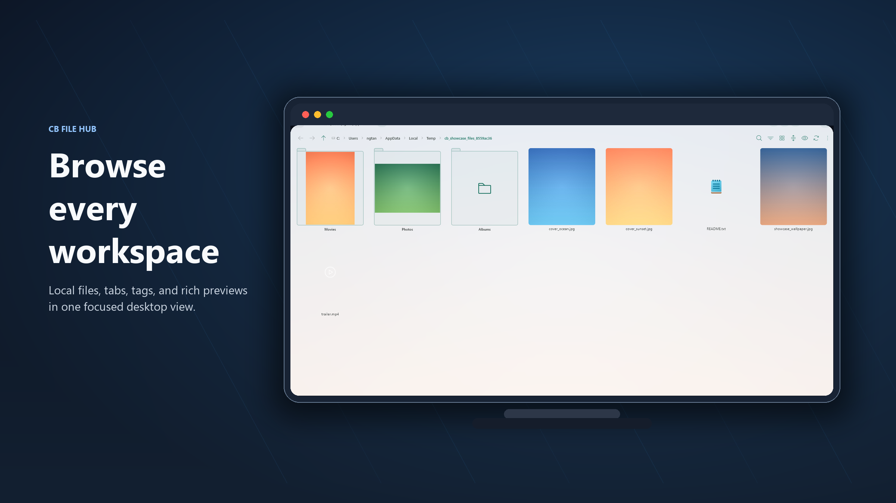
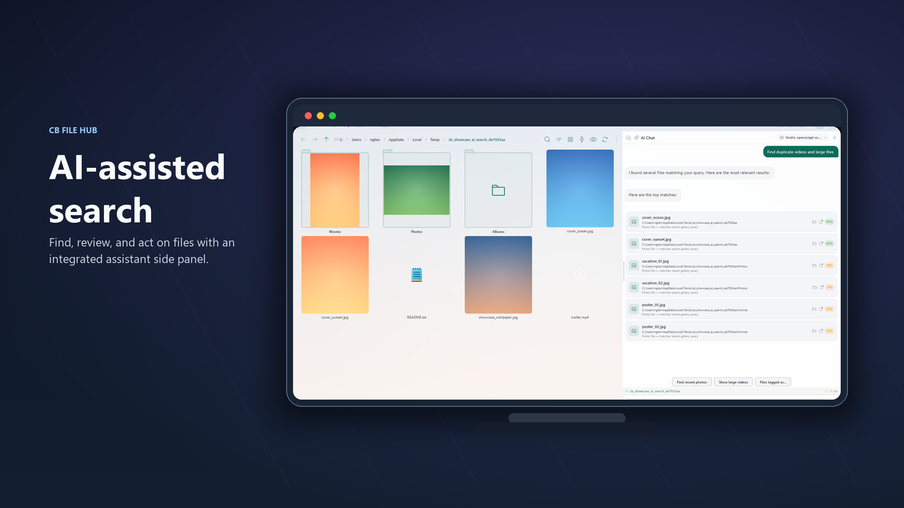
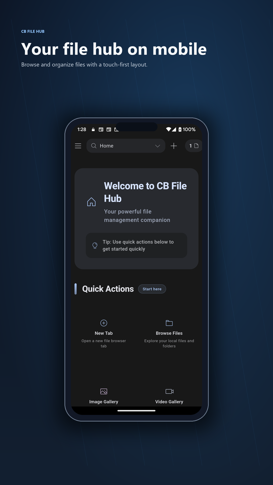
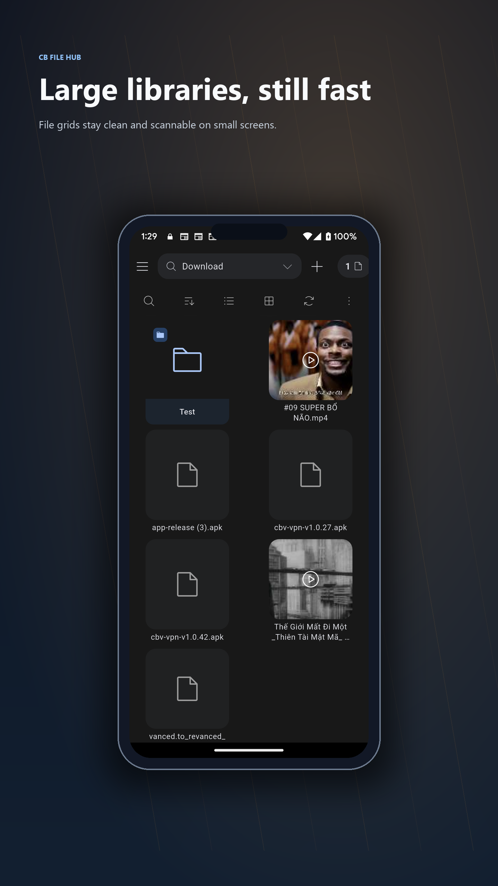
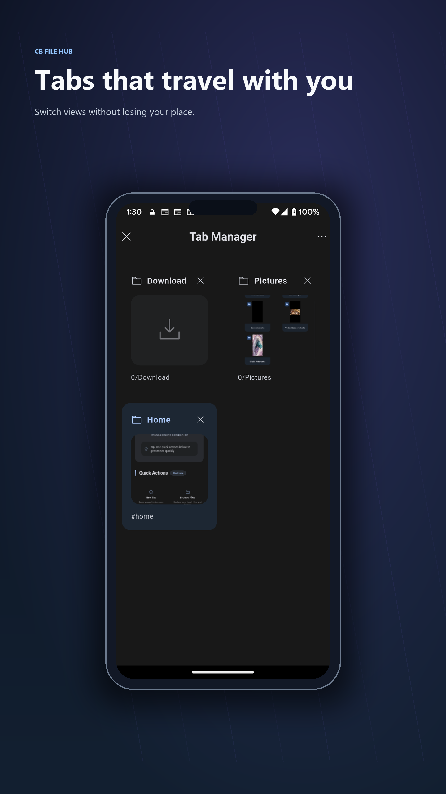
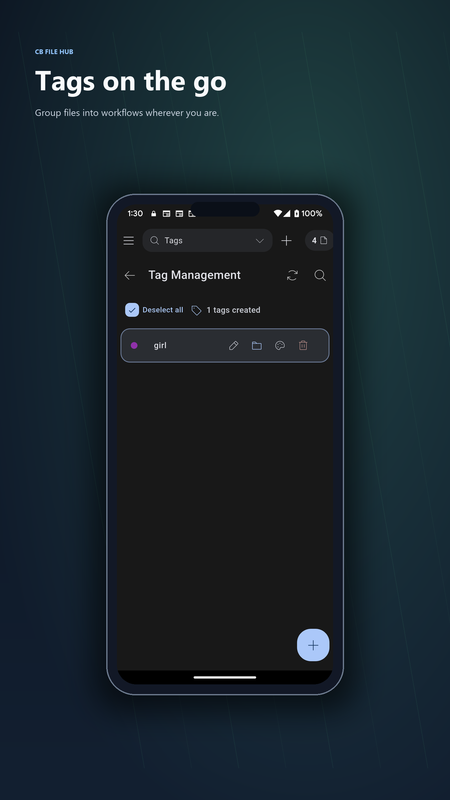

# CB File Hub - Smart AI File & Content Manager

[](https://github.com/coolbirdzik/cb-file-hub/actions/workflows/build-test.yml)
[](https://github.com/coolbirdzik/cb-file-hub/actions/workflows/release.yml)
[](LICENSE)

<p align="center">
  
</p>

<p align="center">
<a href="https://apps.microsoft.com/detail/9nchpzkc4m5c?referrer=appbadge&mode=full" target="_blank"  rel="noopener noreferrer">
	
</a>
</p>

CB File Hub is a cross-platform file manager focused on large personal media libraries. It is built for the situation where movies, photos, clips, and folders keep growing until finding the right thing to watch feels harder than watching it.

Instead of acting like a generic explorer, the app is designed to reduce browsing fatigue: faster visual scanning, tag-based organization, tabbed navigation on both desktop and mobile, network playback, and albums that can organize themselves with rules.

## Preview

<table>
  <tr>
    <td colspan="4">
      
      <p align="center"><sub>Desktop file browsing with tabs, tags, and rich previews</sub></p>
    </td>
  </tr>
  <tr>
    <td colspan="4">
      
      <p align="center"><sub>AI-assisted search beside the file browser</sub></p>
    </td>
  </tr>
  <tr>
    <td align="center">
      
      <p align="center"><sub>Mobile home</sub></p>
    </td>
    <td align="center">
      
      <p align="center"><sub>File grid</sub></p>
    </td>
    <td align="center">
      
      <p align="center"><sub>Tabs</sub></p>
    </td>
    <td align="center">
      
      <p align="center"><sub>Tags</sub></p>
    </td>
  </tr>
</table>

### AI Agent

The AI side panel sits beside the file browser. Ask it to find files, clean up duplicates, or organize folders — it shows results inline and asks for approval before making any changes.

## Why This App Exists

This project started from a very personal problem: a movie and photo collection that became too large to browse comfortably. File names were not enough, folder trees became noisy, and searching for something to watch or review took too much effort.

CB File Hub focuses on solving that workflow with a media-first file manager that helps you browse visually, organize flexibly, and jump back into your library without losing context.

## Highlights

- **Media-first file management**: Browse local folders with layouts that work better for photos, videos, and mixed libraries than a plain file list.
- **AI file agent**: Let an AI agent help search files, create files and folders, manage moves and cleanup, find suspicious or problematic files, organize messy folders, and automate more library work.
- **Tabbed browsing on desktop and mobile**: Open multiple locations at once, switch contexts quickly, and keep parallel browsing flows alive on both Windows and Android.
- **Tag files and search by tags**: Add tags to files, reuse popular tags, and search with single or multiple tags to narrow a large library fast.
- **Parent/child tag hierarchy**: Organize tags into nested relationships (for example `Media → Movies → Action`) and browse them in a dedicated tree view.
- **List, grid, and tree views**: Switch the tag manager and file browsers between a flat list, a visual grid, and an expandable tree using the same view-mode menu.
- **Smart albums with dynamic rules**: Build albums that automatically collect matching files from selected source folders using filename-based rules.
- **Choose the video thumbnail frame**: Control the extraction position used for video thumbnails so previews represent the part of the clip that actually matters.
- **Watch videos over SMB and FTP**: Open and stream media from network locations without turning your workflow into manual copy-paste.
- **Fast thumbnails for local and network media**: Generate thumbnails for images, videos, folders, and supported network files with caching to keep browsing responsive.
- **Pinned places and workspace memory**: Pin important folders in the sidebar and restore the last tab workspace with per-tab drawer state.
- **Built-in galleries for photos and videos**: Move from raw folder browsing into image and video focused views when you want to scan a collection visually.
- **Cross-platform foundation**: Built with Flutter and currently targeting Windows, Android, Linux, and macOS.

## Main Features

### File management and browsing

- Browse local storage and network locations in a unified interface.
- Open directories in multiple tabs.
- Use the same tab-oriented workflow across desktop and mobile.
- Pin folders, drives, or favorite locations to the sidebar.
- Restore the last opened tab workspace when returning to the app.

### AI file agent

- Search across folders with natural-language requests instead of exact file names.
- Create files and folders from user intent when routine setup work gets repetitive.
- Manage files with guided actions such as rename, move, copy, delete, and batch organization.
- Find files that may need attention, including broken media, missing thumbnails, duplicates, odd names, or misplaced items.
- Sort messy downloads, recordings, photos, and videos into clearer folder structures.
- Assist with larger cleanup workflows while keeping file operations visible and controllable.

## AI Agent Workflow

CB File Hub is designed to be a strong base for an AI-assisted file workflow, especially when a library becomes too large to manage manually.

The AI agent can be introduced in the product and project documentation as a practical file operations assistant that helps users:

- Search for files and folders with natural-language requests.
- Create files or folders for repetitive setup tasks.
- Manage file operations such as rename, move, copy, delete, and batch cleanup.
- Detect files that may have issues, such as broken media, missing thumbnails, duplicates, unexpected names, or misplaced content.
- Sort and reorganize cluttered folders into cleaner structures.
- Assist with broader maintenance workflows across large personal media libraries.

This positioning keeps the AI feature grounded in real file-management jobs instead of vague chatbot behavior.

### Tagging and discovery

- Add tags to files to create your own organization layer beyond folder names.
- Search by tag using direct tag paths and multi-tag filtering.
- Reuse recent and popular tags for faster tagging.
- Display tags directly in file and gallery views for quick visual context.
- Build a parent/child tag hierarchy and browse it as an expandable tree.
- Filter and sort tags in the tag manager, and switch between list, grid, and tree layouts.

### Tree view

- Browse hierarchical data as a virtualised, expandable tree that stays smooth even with very large folders.
- Available in the tag manager (parent/child tags), the local file browser, and network browsers (SMB/FTP).
- Folders load their children on demand the first time they are expanded, then cache the result.

### Media workflow

- Generate image, video, and folder thumbnails.
- Tune video thumbnail extraction position from settings.
- Browse dedicated image and video gallery views.
- Use the built-in video player for local and supported network files.
- Support desktop-oriented media workflows such as external opening and focused playback.

### Network access

- Browse SMB shares.
- Connect to FTP servers.
- Generate thumbnails for supported network files.
- Stream supported media directly from network locations.
- Store network credentials locally for faster reconnects.

### Album automation

- Create albums for curated collections.
- Create smart albums driven by dynamic rules.
- Match files into albums automatically based on filename patterns.
- Scope rules to selected source folders so albums stay relevant instead of noisy.

## Platforms

- Windows
- Android
- Linux
- macOS

## Downloads

Latest packaged builds are published here:

[Download Latest Release](https://github.com/coolbirdzik/cb-file-hub/releases/latest)

Available package types include:

- Windows: portable ZIP, EXE installer, MSI installer
- Android: APK and AAB
- Linux: `tar.gz`
- macOS: ZIP

## Quick Start

### Windows

1. Download the latest Windows package from the releases page.
2. Install with the EXE or MSI package, or extract the portable ZIP.
3. Run `cb_file_manager.exe`.

### Android

1. Download the latest APK.
2. Allow installation from unknown sources if needed.
3. Install and launch the app.

### Linux

```bash
tar -xzf CBFileManager-<version>-linux.tar.gz
cd bundle
./cb_file_manager
```

### macOS

1. Download the macOS ZIP package.
2. Extract it and move the app into `Applications`.
3. Open it from Finder.

## Development

### Prerequisites

- Flutter SDK 3.41.5 or later
- Dart SDK 2.15.0 or later
- Visual Studio 2022 with C++ tools for Windows builds
- Android SDK and JDK 17+ for Android builds
- GTK3 development libraries for Linux builds
- Xcode and CocoaPods for macOS builds

### Local setup

```bash
git clone https://github.com/coolbirdzik/cb-file-hub.git
cd cb-file-hub/cb_file_manager
flutter pub get
flutter run
```

Enable the developer overlay only for local development:

```bash
flutter run --dart-define=CB_SHOW_DEV_OVERLAY=true
```

### Build commands

```bash
# Windows
flutter build windows --release

# Android APK
flutter build apk --release --split-per-abi

# Android AAB
flutter build appbundle --release

# Linux
flutter build linux --release

# macOS
flutter build macos --release
```

You can also use the helper scripts:

```bash
chmod +x scripts/build.sh
./scripts/build.sh
```

Or use `make` targets:

```bash
make help
make windows
make android
make linux
make all
```

### Screenshot automation

Generate lightweight showcase screenshots for the main app features on desktop and Android:

```bash
# Windows desktop screenshots
./scripts/capture_screenshots.sh desktop

# Android screenshots, using first connected Android device or emulator
./scripts/capture_screenshots.sh android

# Both targets
./scripts/capture_screenshots.sh all
```

On Windows PowerShell, use the native script instead of the Bash wrapper:

```powershell
# Windows desktop screenshots
./scripts/capture_screenshots.ps1 desktop

# Android screenshots, using the first connected Android device or emulator
./scripts/capture_screenshots.ps1 android

# Both targets
./scripts/capture_screenshots.ps1 all
```

Output files are copied to:

```text
screenshots/auto/desktop/
screenshots/auto/android/
```

The screenshot scripts use a dedicated showcase E2E flow and export only the final hero frames for each featured scenario, not every intermediate test step.

Android requires a connected device or running emulator visible in `flutter devices`.

Generate promotional artwork from the captured screenshots:

```powershell
python scripts\make_promo_images.py
```

The generated artwork is written to `screenshots/promo/desktop/`, `screenshots/promo/mobile/`, `screenshots/promo/vi/desktop/`, and `screenshots/promo/vi/mobile/`.

## Testing

```bash
flutter test
flutter analyze
dart format --output=none --set-exit-if-changed .
```

## Project Structure

```text
cb_file_manager/
├── lib/
├── assets/
├── test/
└── pubspec.yaml
```

## Documentation

- [Quick Start Guide](QUICK_START.md)
- [Build Instructions](scripts/README.md)
- [Windows Setup Guide](WINDOWS_SETUP.md)
- [Windows Build Fix Notes](WINDOWS_BUILD_FIX.md)
- [Release Guide](RELEASE_GUIDE.md)
- [Contributing](CONTRIBUTING.md)
- [Changelog](CHANGELOG.md)

## Contributing

Contributions are welcome. Open an issue for bugs or feature requests, or submit a pull request if you want to improve the app.

## License

This project is licensed under the MIT License. See [LICENSE](LICENSE) for details.
