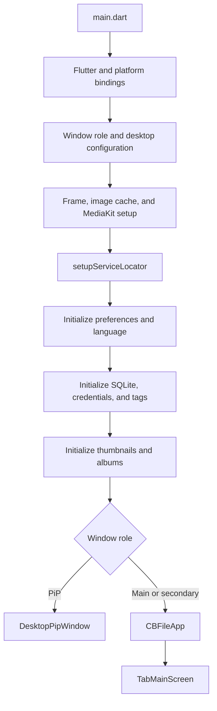
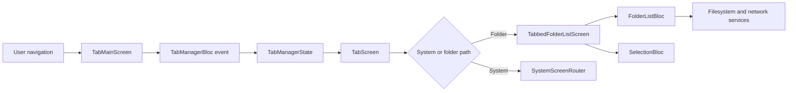
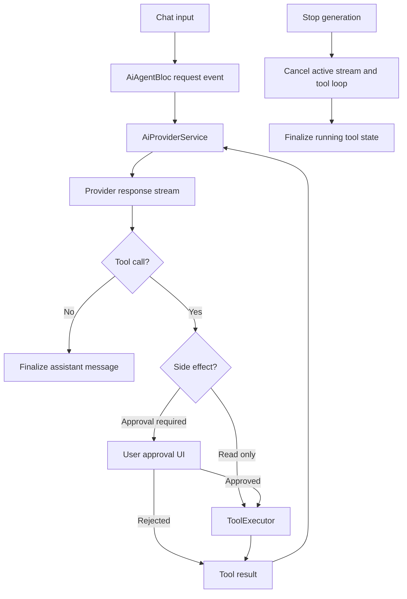
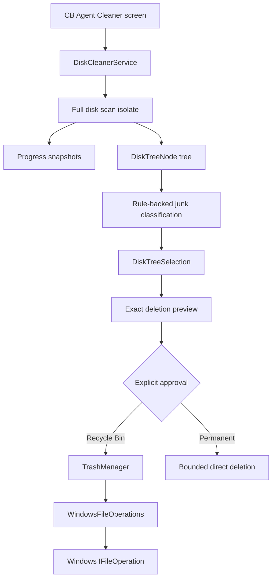
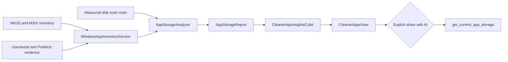
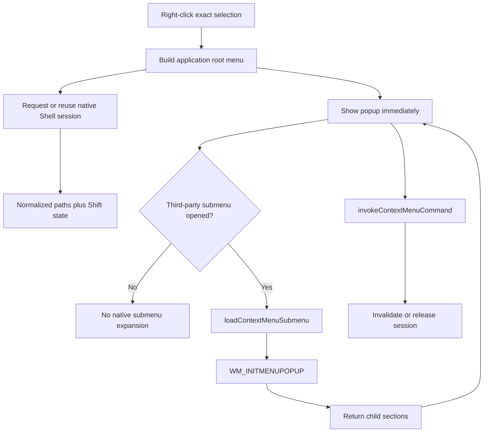

# Agent Graph — Core Execution Flows

These diagrams show runtime ownership and safety boundaries. They intentionally
omit low-value helper calls. Use `feature-map.yaml` for concrete source paths.

## Application startup



Secondary windows can defer selected initializers until after their first
frame. Read `main.dart` before changing startup order; helpers under
`lib/config/` are not a substitute for verifying the active call path.

## Tab and folder navigation



Provider context is part of the ownership contract. Menus, dialogs, overlays,
and detached windows that operate on a pane must receive that pane's BLoC
instance rather than resolving an unrelated ancestor.

## AI agent tool loop



Every async continuation must verify that it still belongs to the active
generation. Read-only labels do not override actual side effects; the tool
implementation and approval registry must agree.

## Cleaner scan, review, and deletion



The scan can report usage without authorizing deletion. Safe ancestors,
application install folders, user data, and shared/unattributed folders do not
become junk merely because they are large.

## Cleaner App Insights



Usage timestamps are evidence with confidence, not proof that an application
is unused. The AI tool is read-only and must redact paths unless the selected
application and sharing options permit them.

## Windows Shell context menu



The cache is process-local and target-specific. Never persist native command
IDs or reuse them for another selection.

## Local GGUF inference

```mermaid
flowchart LR
    Settings[Local AI settings] --> Advisor[LocalAiAdvisorService]
    Advisor --> Runtime[GgufLlamaCppRuntime]
    Runtime --> Process[llama/llama-server.exe]
    Process --> Health[/health]
    Process --> Chat[HTTP chat completion]
    Runtime --> Reaper[Windows Job Object]
    Reaper --> Kill[KILL_ON_JOB_CLOSE]
```

The runtime is isolated in the `llama/` subfolder so Windows resolves the
system Vulkan loader instead of the unrelated app-local Vulkan DLL.

_Verified against repository baseline `7f40c2a` plus the working tree on
2026-08-09._
