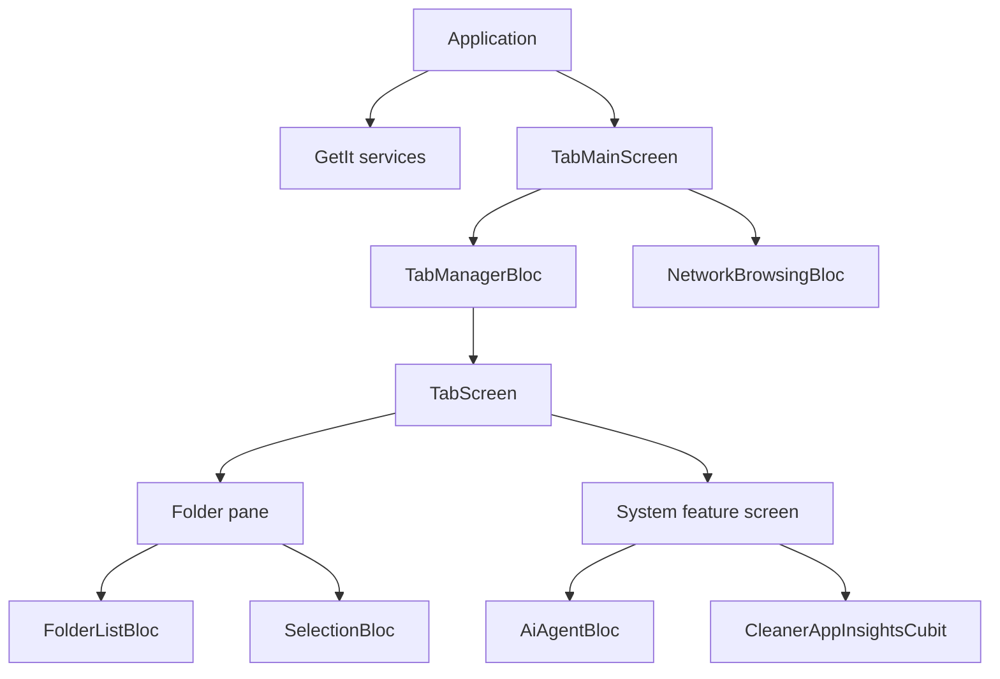

# Agent Graph — State Ownership and Lifetime

Use this map before adding a singleton, provider, cache, notifier, or BLoC.
Ownership errors in this application commonly appear as cross-tab state leaks,
stale async results, lost provider context, or expensive pane rebuilds.

## Ownership map

| State or capability | Owner | Lifetime | Primary source |
| --- | --- | --- | --- |
| Theme | `ThemeProvider` via Provider/GetIt | Application | `cb_file_manager/lib/providers/theme_provider.dart` |
| Language | `LanguageController` via GetIt | Application | `cb_file_manager/lib/config/language_controller.dart` |
| Structured persistence | `DatabaseManager` via GetIt | Application | `cb_file_manager/lib/models/database/database_manager.dart` |
| Tab collection and active tab | `TabManagerBloc` | Main tab shell | `cb_file_manager/lib/ui/tab_manager/core/tab_manager.dart` |
| Network connections | `NetworkBrowsingBloc` | Main tab shell | `cb_file_manager/lib/bloc/network_browsing/` |
| Folder contents and view state | `FolderListBloc` | Folder pane | `cb_file_manager/lib/ui/screens/folder_list/folder_list_bloc.dart` |
| File selection | `SelectionBloc` | View or pane | `cb_file_manager/lib/bloc/selection/selection_bloc.dart` |
| AI conversation execution | `AiAgentBloc` | AI chat tab/surface | `cb_file_manager/lib/bloc/ai_agent/ai_agent_bloc.dart` |
| Cleaner scan engine | `DiskCleanerService` via GetIt | Application service; scan state is session-bound | `cb_file_manager/lib/services/disk_cleaner/disk_cleaner_service.dart` |
| Cleaner App Insights filters | `CleanerAppInsightsCubit` | Cleaner Apps pane | `cb_file_manager/lib/bloc/cleaner_app_insights/cleaner_app_insights_cubit.dart` |
| Local model catalog/runtime | `LocalAiAdvisorService` via GetIt | Application; runtime changes with model/context | `cb_file_manager/lib/services/local_ai/local_ai_advisor_service.dart` |
| Tab inactivity evaluation | `TabActivityManager` via GetIt | Application | `cb_file_manager/lib/services/tab_activity/tab_activity_manager.dart` |
| Shell context menu session | `WindowsShellContextMenu` cache | Exact selection plus Shift state, bounded TTL and leases | `cb_file_manager/lib/helpers/files/windows_shell_context_menu.dart` |

## Ownership graph

## Rules

- Resolve a long-lived service through GetIt only if it is registered in
  `lib/core/service_locator.dart`.
- Pass pane-owned BLoCs into overlays or menus with `BlocProvider.value` or an
  explicit parameter when the overlay is outside the original subtree.
- Scope caches by every value that changes their correctness. Path-only keys
  are insufficient when tab, selection, Shift state, provider, or model also
  changes behavior.
- Guard asynchronous results with the owning generation/session identity.
- Preserve expensive pane state with mounted children and narrow notifiers when
  switching views; do not rebuild a disk tree or reload native icons solely to
  change the visible pane.
- Dispose screen-owned cubits, subscriptions, controllers, and notifiers with
  their screen. Do not dispose GetIt-owned services from a screen.

_Verified against repository baseline `7f40c2a` plus the working tree on
2026-08-09._
