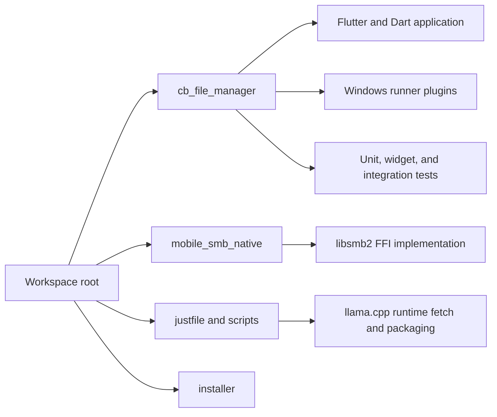
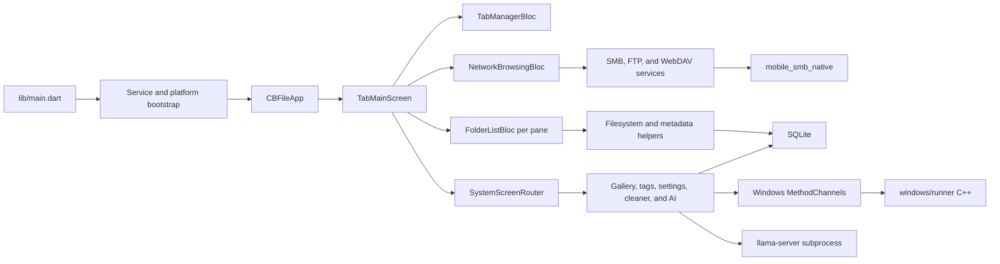
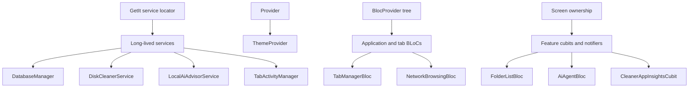
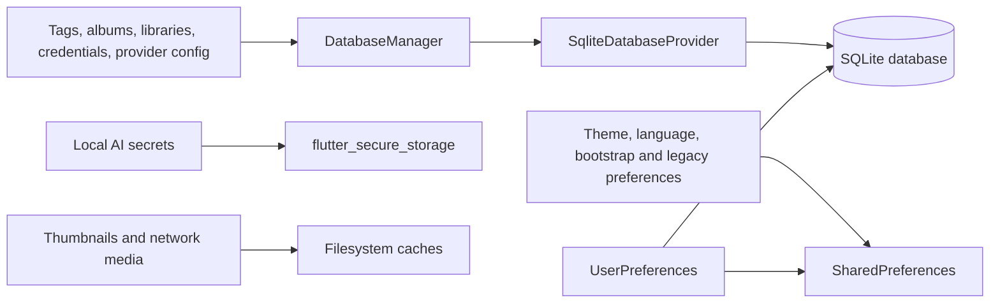
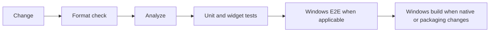
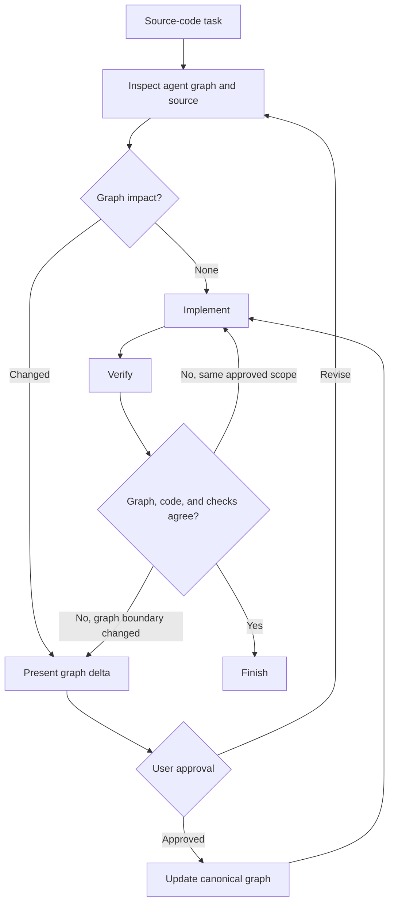

# Agent Graph — System Map

## Workspace boundaries

- Run all `flutter` and `dart` commands from `cb_file_manager/`.
- Use the workspace-root `justfile` as the primary build and verification
  interface.
- `mobile_smb_native/` is a local path dependency, not a child folder of the
  Flutter package.
- `cb_file_manager/windows/llama/` is fetched build input and is not committed.

## Application runtime graph

## State and dependency boundaries

Use `lib/core/service_locator.dart` to verify which services are process-wide.
Do not infer that every class named `Service` is registered with GetIt.

## Persistence boundaries

Files under `lib/models/objectbox/` retain legacy names for compatibility, but
the active database provider is SQLite. Never infer the active backend from a
legacy import path alone.

## Verification boundary

The CI order is format, analyze, unit tests, E2E, then build. Focused checks may
be used during iteration, but they do not redefine the final risk boundary.

## Graph-first coding loop

Reading and classifying graph impact is mandatory for source-code tasks. User
approval is required only when nodes, edges, ownership, contracts, scope,
destructive behavior, or safety invariants change. Failures within the approved
scope loop through implementation and verification without another approval.

_Verified against repository baseline `7f40c2a` plus the working tree on
2026-08-09._
